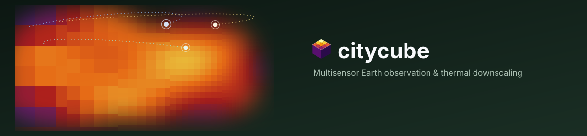

[](https://github.com/JSempereH/citycube/actions/workflows/ci.yml)
[](LICENSE)
[](pyproject.toml)
[](https://jsempereh.github.io/citycube/)

`citycube` turns a city, or any polygon, and a date range into ready-to-use
satellite data cubes: Sentinel-1/2/3/5P, Landsat, ECOSTRESS, weather and air
quality on one grid and one time axis. It sharpens land surface temperature
with Sentinel-2 (Sentinel-3 from 1 km to 100 m, Landsat from 100 m to 30 m)
and summarises results per district. It runs
as a Python library, a command line or a small web service.

Documentation: [jsempereh.github.io/citycube](https://jsempereh.github.io/citycube/)

---

## Quick Start

```bash
cp .env.example .env
uv sync --extra dev --extra auxiliary --extra optical
uv run pytest -q
```

For local documentation:

```bash
uv sync --extra docs
uv run mkdocs serve
```

Credentials (CDSE, ERA5, CAMS, OpenAQ, Earthdata) are covered in
[`docs/setup.md`](docs/setup.md).

---

## E2E Smoke Test

With credentials configured and the CDS/ADS licenses accepted:

```bash
uv run --extra auxiliary --extra optical python scripts/smoke_e2e.py
```

The test downloads one Sentinel-3 scene, one ERA5 variable, one CAMS variable,
and a small set of OpenAQ stations for Berlin on one day. Results are written
to `output/e2e-smoke/`, which is ignored by Git.

You can also inspect a request without downloading data:

```bash
uv run citycube plan request.json
uv run citycube discover request.json
uv run citycube auxiliary request.json output/auxiliary
```

And run a request end to end, writing the cubes as Zarr:

```bash
uv run --extra optical --extra cloud citycube run request.json output/run
```

---

## Architecture

```text
src/citycube/
  sensors/       Sentinel-1/2/3/5P, Landsat 8/9, and ECOSTRESS readers/catalogs
  providers/     ERA5, CAMS, and OpenAQ
  workflow/      requests, planning, per-sensor adapters, fusion, and results
  downscale/     OLS/TsHARP, any scikit-learn estimator (RF, XGBoost), GWR,
                 coarse-scale conservation, STARFM/ESTARFM
  cube.py        grids (incl. AnalysisGrid.for_aoi) and the spatial contract
  metadata.py    units, provenance, and scientific contracts
```

Sentinel-1 has four interchangeable `sentinel1_backend` options -
`"snap"` (default, local SNAP GPT), `"hyp3_rtc"` (ASF HyP3 cloud
processing, no SNAP needed; not yet run against a real submission),
`"pc_rtc"` (Planetary Computer's pre-processed RTC COGs, read in place),
and `"s1ard"` (pyroSAR NRB, currently broken - see `docs/limitations.md`).
Sentinel-2 can likewise be read in place from STAC COGs with
`sentinel2_source="stac_cog"` instead of downloading full SAFE archives.
Both cloud-native options are validated against real scenes. Each sensor's search/acquisition lives in one adapter in
`workflow/adapters.py`. Landsat/ECOSTRESS are independent thermal
references used as validation/predictors alongside Sentinel-3's own `lst`.
`downscale/`'s models turn a coarse thermal field into a fine-resolution
one using Sentinel-2 predictors - see
[`docs/downscaling.md`](docs/downscaling.md) for how it works and how well
it matches Landsat.

A request can also keep only daytime thermal passes
(`thermal_overpass="day"`), downscale every scene as a final workflow stage
(`downscale=DownscaleSpec(...)`), and skip individual products that fail to
download or read (`on_product_error="skip"`, the default; failures are
listed in the result's provenance). `execute()` estimates the in-memory
size of a request and rejects one that is too large before downloading
anything. See [`docs/workflows.md`](docs/workflows.md).

`citycube` is the only current package name (it was `sentinel_analysis`
until 2026-10-10). `Sentinel3LST` is the local Sentinel-3 facade, while
`Sentinel3LSTClient` is the remote openEO client.

### citycube-worker

`worker/` wraps `AnalysisWorkflow.execute()` behind a small FastAPI service
(`POST /jobs`, `GET /jobs/{id}`, `GET /jobs/{id}/result`) so a multisensor run
can be driven over HTTP from a separate machine with the heavy geospatial
extras installed. It ships its own UI (`worker/frontend/`, served by the
worker itself) and remains fully drivable via its bare HTTP API too - see
[`worker/README.md`](worker/README.md) and [`docs/platform.md`](docs/platform.md).

---

## Validation

```bash
uv run --extra dev --extra auxiliary --extra optical pytest -q
uv build
```

Real-product tests are optional and never download files by themselves. See
the complete guide in [`docs/`](docs/index.md).

The research behind the downscaling design, every benchmark run, and the
guarded OpenAQ station interpolation are documented in
[`dev/downscaling-research.md`](dev/downscaling-research.md).

---

## License

Licensed under the [European Union Public Licence v. 1.2](LICENSE) (EUPL-1.2).
