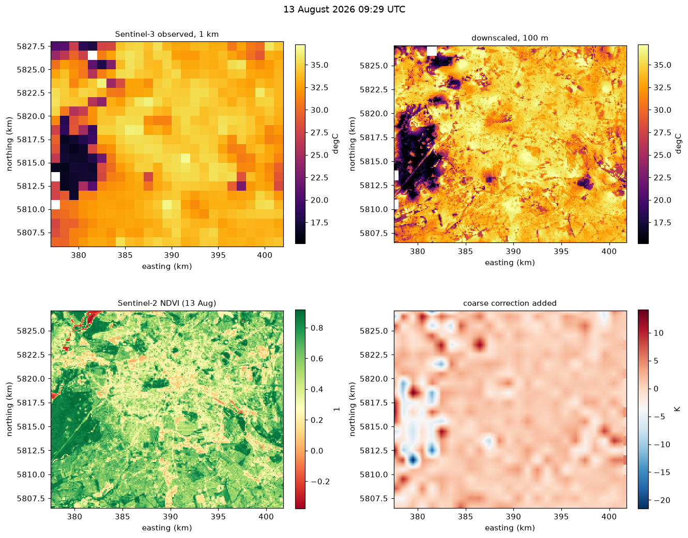
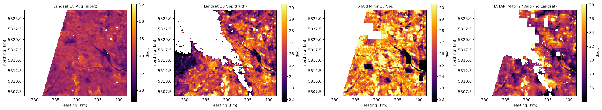
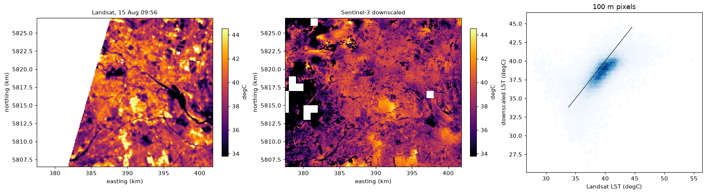
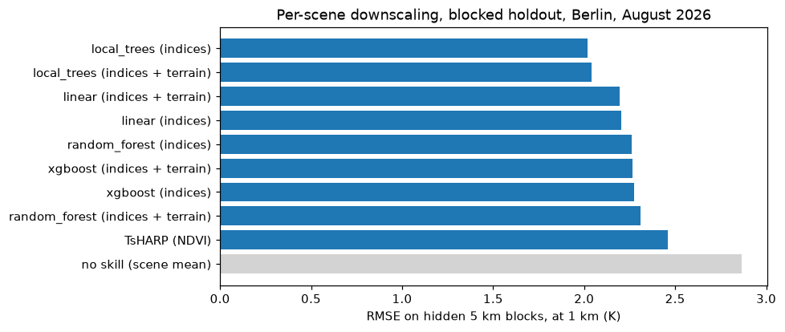

# Downscaling and Fusion

This document records the scientific implementation plan for fusing Sentinel
and environmental observations into a defensible high-resolution urban heat
product. The goal is not to make a sharper-looking raster: every fine-scale
prediction must remain traceable to observations, predictors, uncertainty and
the original coarse thermal measurement.

## Evidence From The Literature

The current evidence supports a staged approach rather than jumping directly
to a deep super-resolution model:

- The LST downscaling survey by Zhan et al. identifies the main risks as mixed
  pixels, scale mismatch, non-stationarity, and validation leakage
  ([10.1016/j.rse.2012.12.014](https://doi.org/10.1016/j.rse.2012.12.014)).
- TsHARP is a useful physically interpretable baseline based on the relation
  between temperature and vegetation indices
  ([10.1016/j.rse.2006.10.006](https://doi.org/10.1016/j.rse.2006.10.006)).
- Random forest and other nonlinear models generally improve over simple
  sharpening baselines in heterogeneous areas, but their performance depends
  strongly on feature selection and mixed-pixel handling
  ([10.1016/j.rse.2016.03.006](https://doi.org/10.1016/j.rse.2016.03.006),
  [10.1109/JSTARS.2019.2896923](https://doi.org/10.1109/JSTARS.2019.2896923)).
- Geographically weighted machine learning explicitly models local
  non-stationarity and is a strong urban baseline
  ([10.3390/rs13061186](https://doi.org/10.3390/rs13061186)).
- STARFM/ESTARFM and FSDAF remain important spatiotemporal-fusion baselines.
  They should be benchmarked before any neural model
  ([10.1016/j.rse.2010.05.032](https://doi.org/10.1016/j.rse.2010.05.032),
  [10.1016/j.rse.2020.111973](https://doi.org/10.1016/j.rse.2020.111973)).
- A review of multisource fusion describes the trade-off between spatial
  detail, temporal continuity, radiometric consistency and change detection
  ([10.3390/rs10040527](https://doi.org/10.3390/rs10040527)).
- Deep learning can improve texture and nonlinear relationships, but random
  pixel splits produce optimistic scores. Spatial, temporal and cross-region
  holdouts are required before claiming generalization.

## Recommended Model Ladder

### Stage 0: Measurement and scale contract

- Use Sentinel-3 LST as the coarse thermal target.
- Keep Sentinel-2, Sentinel-1, Sentinel-5P, ERA5, CAMS and OpenAQ as named
  predictors or reference observations.
- Harmonize CRS, pixel support, units, quality masks and acquisition times
  before model fitting.
- Store the coarse target, fine prediction, support mask, predictor names,
  model version and training footprint in the result.

### Stage 1: Auditable baselines

Implement and benchmark these in order:

1. Nearest/area-preserving resampling as a no-skill reference.
2. TsHARP/DisTrad-style index sharpening where assumptions are satisfied.
3. Global linear regression with explicit residual uncertainty.
4. Random forest and XGBoost with feature selection and monotonic sanity
   checks.
5. Geographically weighted regression or a geographically weighted ensemble
   such as MFGWML for urban non-stationarity.

The first production candidate should be a constrained ensemble of stages 3
to 5, not an unconstrained neural super-resolution model.

### Stage 2: Coarse-scale consistency

Every fine prediction must be reaggregated to the Sentinel-3 support. The
training objective and post-processing should penalize disagreement with the
observed coarse LST:

```text
coarse_consistency_error = aggregate(fine_prediction) - coarse_lst
```

The error, tolerance and aggregation operator must be stored and reported.
This prevents a model from generating plausible local texture while violating
the measured thermal energy at the source scale.

### Stage 3: Spatiotemporal fusion

- Use STARFM/ESTARFM or FSDAF as classical references for temporal gap filling
  where compatible high- and low-resolution pairs exist.
- For LST, explicitly test whether reflectance-fusion assumptions transfer to
  temperature. Do not reuse an optical fusion result as thermal truth.
- Add change-aware handling for cloud, land-cover change and heatwave dates.
- Compare `blend-then-index` and `index-then-blend` for optical predictors;
  the choice can change the result in nonlinear indices.

### Stage 4: Deep models, only after baselines

Evaluate residual U-Net or CNN/Transformer hybrids only when there are enough
co-located scenes. Use auxiliary losses for:

- coarse-scale consistency;
- valid-pixel and cloud-mask support;
- temporal stability;
- uncertainty calibration.

Use ensembles, quantile regression or conformal calibration for predictive
uncertainty. A neural model must beat the classical baselines on blocked
holdouts, not only on random pixel splits.

## Predictor Design

The initial urban feature set should include:

- Sentinel-2 reflectance, NDVI, EVI, NDMI, NDBI, MNDWI and cloud support;
- Sentinel-1 sigma0/gamma0, polarization ratios and acquisition geometry;
- Sentinel-5P gas columns with explicit column-to-surface caveats;
- ERA5 meteorology and CAMS composition;
- land cover, imperviousness, elevation and morphology where available;
- OpenAQ station observations plus an interpolation-support mask.

Feature selection must be done inside each training fold. Variables that are
not available at inference time must not enter the training set.

## Validation Protocol

The validation dataset must be split by geography and time, not by random
pixels:

- blocked neighborhoods for spatial generalization;
- held-out dates and seasons for temporal generalization;
- heatwave dates as a stress test;
- independent thermal references such as Landsat or ECOSTRESS when available;
- leave-one-station-out validation for OpenAQ interpolation.

Report RMSE, MAE, bias, correlation, high-temperature error, valid coverage,
coarse-scale conservation error and calibrated uncertainty coverage. Report
metrics separately for vegetation, impervious, water and mixed urban pixels.

`blocked_spatiotemporal_split` holds out the latest `validation_fraction` of
acquisitions and a diagonal pattern of `block_size` x `block_size` pixel
blocks. Its default `block_size=1` holds out single pixels whose direct
neighbours all stay in training, which spatial autocorrelation makes
optimistic; pass a block several kilometres wide (`block_size=5` on a 1 km
thermal grid) for a genuinely spatial test. The split refuses an unsorted
time index, since "the latest acquisitions" is taken by position (cubes
produced before the time-ordering fix were unsorted, so earlier benchmark
runs' temporal holdout was not the final period - see `history.md`).

### Calibrated prediction intervals

`fit_conformal_downscaler(model, calibration, alpha=0.1)` wraps any fitted
downscaler with split-conformal intervals (`lst_downscaled_lower`/`upper`,
and `lst_downscaled_uncertainty` becomes the interval half-width) that have
a finite-sample coverage guarantee on exchangeable held-out data. Calibrate
on `blocked_calibration_split(...)` with the same split arguments: the
spatially held-out blocks at training times, unseen by the model and
earlier than the validation set. When the base model is a tree ensemble
(Random Forest), intervals are *normalized* by the per-pixel spread across
its trees (`ensemble_spread`), so they widen where the model is unsure;
other models get constant-width intervals. `validate_downscaler` then
reports `interval_coverage` and `interval_mean_width`. Calibration happens
at the coarse scale; using the quantile for fine-resolution predictions
assumes the error distribution transfers across scales, which the
intervals record in their attributes rather than claim to verify.

## OpenAQ Surface Interpolation

OpenAQ measurements are still preserved in `AnalysisResult.auxiliary['openaq']`
as a station table. When a predictor grid is configured, the workflow also
creates a guarded raster using inverse-distance weighting (IDW):

- matching station observations use the nearest time within the configured
  temporal tolerance;
- distances are computed in the projected analysis CRS;
- cells outside `interpolation_max_distance_m` remain missing;
- cells with fewer than `interpolation_min_neighbors` remain missing;
- at most `interpolation_max_neighbors` nearest stations contribute;
- each interpolated variable receives station-count, uncertainty and valid
  support diagnostics.

The default is intentionally conservative. IDW is a reproducible operational
surface, not proof that pollutant concentrations are spatially smooth. Kriging
or a land-use/meteorology regression should only replace it after variogram
diagnostics and leave-one-station-out validation.

Example request options:

```json
{
  "provider": "openaq",
  "variables": ["NO2"],
  "options": {
    "max_locations": 100,
    "interpolation_method": "idw",
    "interpolation_power": 2.0,
    "interpolation_max_distance_m": 10000,
    "interpolation_min_neighbors": 3,
    "interpolation_max_neighbors": 12
  }
}
```

The fused variable is named `auxiliary_openaq_NO2`; diagnostics are named
`auxiliary_openaq_NO2_station_count`,
`auxiliary_openaq_NO2_interpolation_uncertainty` and
`auxiliary_openaq_NO2_interpolation_valid`.

For station-level validation, call
`OpenAQProvider.validate_leave_one_station_out(stations, "NO2")`. The result
contains global RMSE/MAE/bias, supported coverage and per-station metrics. This
must be reported before replacing guarded IDW with kriging or land-use
regression.

## Implemented Model APIs

`downscale_per_scene(cube, predictors["sentinel2"], ...)` is the end-to-end
entry point and what `AnalysisRequest.downscale` runs: one `"linear"`,
`"random_forest"`, `"xgboost"` or `"local_trees"` model per coarse scene, fitted on that
scene's own cells, predicting its matched fine predictors (Sentinel-2 by
default, with `cos_incidence` recomputed at the thermal acquisition time),
wrapped by default in `CoarseConsistentDownscaler`. Per-scene
`coarse_consistency_rmse` and `downscaling_training_samples` are variables
along `time`; skipped scenes are listed in `downscaling_skipped_scenes`. The
building blocks below remain available for other protocols (pooled
training, GWR, conformal intervals, spatiotemporal fusion).

The package now exposes `fit_tsharp_downscaler` and
`fit_coarse_consistent_tsharp_downscaler` for the interpretable one-predictor
TsHARP/DisTrad relation. `fit_xgboost_downscaler` and
`fit_coarse_consistent_xgboost_downscaler` are available through the optional
`ml` extra and preserve the same finite-support and coarse-consistency
contracts as the existing Random Forest model. Both are
thin wrappers over `fit_sklearn_downscaler`, which accepts any unfitted
scikit-learn-compatible regressor (`fit`/`predict`) and returns a
`SklearnDownscaler` with the same contracts. The models live in the
`citycube.downscale` package (`regression`, `gwr`, `consistency`,
`spatiotemporal`); every public name is still importable from
`citycube.downscale` and `citycube`. Use
`blocked_spatiotemporal_split` or the compatibility wrapper
`split_spatiotemporal`, and `validate_independent_reference` for external
Landsat/ECOSTRESS comparisons.

`fit_gwr_downscaler`/`fit_coarse_consistent_gwr_downscaler` (also `ml`) add
a geographically weighted regression baseline: unlike every other model
here, which fits one global relation, `GWRDownscaler.predict` refits local
coefficients at every fine pixel from its `max_local_samples` nearest
coarse training points (via a `scipy.spatial.cKDTree`), weighted by
distance through a `bandwidth`/`kernel` ("bisquare" or "gaussian") pair -
the local non-stationarity a single global slope cannot represent (a park's
NDVI-LST relation is not a city's). `residual_std` is a genuine leave-one-out
cross-validated residual, not the in-sample residual the other models
report, since a naive in-sample GWR residual would partly explain each
point using itself. This is markedly slower than the other downscalers for
large grids (one small weighted least-squares solve per fine pixel) - a
documented tradeoff, not an oversight.

`fuse_starfm` implements STARFM (Gao et al. 2006) as a classical
spatiotemporal-fusion baseline: given a fine observation at t0 and a coarse
change between t0 and t1 (on the same or a different, coarser grid - it
reindexes onto the fine grid itself), it predicts a fine map at t1 by
weighting spatially-nearby, spectrally-similar pixels' own observed change.
This is the single fine/coarse-pair form most open STARFM implementations
use, not the full multi-pair ensemble from the original paper.

`fuse_estarfm` implements ESTARFM (Zhu et al. 2010) on top of the same
window/similarity machinery (`_make_windows`, `_spatial_weight_grid`,
shared with `fuse_starfm`). The real difference from STARFM is not just
"one more pair" - it's *how* a pair's coarse change becomes a fine
prediction: STARFM adds the raw coarse difference directly (implicitly
assuming a 1:1 fine/coarse relationship); ESTARFM fits a local linear
regression between fine and coarse values within each pixel's window
(`_local_linear_regression`, a closed-form per-pixel OLS over the window,
vectorized) and uses that pair's own *slope* to convert its coarse change -
representing a window where the fine/coarse relationship's slope, not just
its offset, differs between two surfaces, exactly what STARFM's raw
difference cannot. The two bracketing pairs' predictions are combined
weighted by each pair's own regression's residual variance, not averaged
blindly; a pair with no local coarse variance to regress against (e.g. a
uniform patch) falls back to STARFM's own identity-slope behavior rather
than being dropped. FSDAF remains an unimplemented open follow-up.

## Worked Example

[`notebooks/04_downscaling.ipynb`](../docs/guides.md) runs the whole chain on real data
over Berlin, August 2026: per-scene downscaling from one request
(`DownscaleSpec`), conservation of the observed scene, an independent
comparison with Landsat at 100 m, a blocked-holdout comparison of linear,
Random Forest, XGBoost, local-window and TsHARP models, conformal intervals,
and STARFM and ESTARFM between two Landsat dates. It prints its verdicts from
the data, including where the sharpened map does not beat the 1 km
observation. [`05_animations.ipynb`](../docs/guides.md) animates observed against
downscaled scenes.





## Local windows against Landsat (2026-10-09)

`model="local_trees"` follows the Data Mining Sharpener (pyDMS): a global
model plus one model per moving window of coarse cells (each trained on its
window extended by 25 %), bagged trees with linear leaves, blended by the
inverse squared residual of each model on its own cells, in radiance.

`scripts/validate_downscaling_landsat.py`, Berlin, 1 to 21 August 2026:
20 daytime Sentinel-3 scenes (15 downscaled, 5 without a Sentinel-2 match),
Sentinel-2 indices and terrain as predictors. Landsat is never used for
training. Two Landsat passes fell on the same morning as a Sentinel-3 scene.
Each cell is downscaled / repeated 1 km observation (K).

| model | holdout RMSE (1 km) | Landsat A: RMSE, r, pattern RMSE | Landsat B: RMSE, r, pattern RMSE |
|---|---|---|---|
| linear | 2.19 | 2.94/2.97, 0.49/0.45, 2.49/2.53 | 2.14/2.28, 0.67/0.51, 1.89/2.04 |
| random_forest | 2.31 | 3.04/2.97, 0.45/0.45, 2.61/2.53 | 2.54/2.28, 0.58/0.51, 2.33/2.04 |
| local_trees, window 5 | 2.20 | 3.00/2.97, 0.45/0.45, 2.55/2.53 | 2.07/2.28, 0.66/0.51, 1.81/2.04 |
| **local_trees, window 10** | **2.04** | 3.00/2.97, 0.46/0.45, 2.57/2.53 | **2.07/2.28, 0.66/0.51, 1.80/2.04** |
| local_trees, window 15 | 2.09 | 3.00/2.97, 0.46/0.45, 2.56/2.53 | 2.14/2.28, 0.65/0.51, 1.89/2.04 |

- On Landsat B every model except the Random Forest beats the repeated
  1 km map; window 10 does best (RMSE -0.21 K, correlation 0.66 against
  0.51, spatial pattern error -0.24 K).
- On Landsat A nothing beats it: all models are within ±0.1 K of the
  baseline. The offset between the two sensors dominates that scene.
- On the blocked holdout window 10 is the best model of all (2.04 K against
  2.19 K for linear and 2.31 K for the Random Forest), so it is the default
  `window`.
- The Random Forest, the previous workflow default, is the worst model
  here on every measure.





Two Landsat scenes in one city are a small sample: treat this as "local
windows help and never hurt much", not as a measured gain. Peak memory of the
whole validation was 0.5 GB.

## Benchmark Results (multi-city)

`scripts/benchmark_multicity.py` (results in
`output/multicity-benchmark/results_v2.json`) runs five preset cities in
two periods (1-14 August and 1-14 April 2026), produced after the
Sentinel-3 orientation, cloud-mask and quality-flag fixes (`history.md`).

**Setup.** Daytime Sentinel-3 passes only (local solar time 08-16 h);
Sentinel-2 L2A from STAC COGs at 100 m; 1 km thermal grid. Holdout: the
latest 30 % of acquisitions x a checkerboard of 5 x 5 km blocks
(`blocked_spatiotemporal_split(block_size=5)`). Every model predicts at
100 m; predictions are reaggregated to 1 km and scored on held-out cells
only. Two predictor sets: Sentinel-2 indices (NDVI, NDBI, EVI, NDMI), and
the same plus terrain (elevation, slope, `cos_incidence` at the Sentinel-3
time). Reference ("no skill"): each scene's mean, i.e. a model that knows
the day's temperature level but no spatial pattern.

**Protocols.**

- *Per scene* (pyDMS's intended use): for each validation scene, the
  model is trained on that scene's non-held-out 1 km cells only.
- *Pooled*: one model trained on all training scenes, then each scene's
  prediction is offset by its mean error on that scene's non-held-out
  cells ("scene-corrected"). Without that correction every model carries a
  -1.5 to -4 K bias: no regression trained on other days can know today's
  overall temperature level, which is why operational downscaling is
  always anchored to the observed coarse scene.

RMSE in K (indices / indices + terrain), per-scene protocol:

| city, month | no skill | OLS | Random Forest | pyDMS local |
|---|---|---|---|---|
| Berlin 08 | 3.99 | 2.79 / 2.69 | 2.55 / 2.57 | 2.72 / **2.43** |
| Berlin 04 | 4.59 | 3.59 / 3.21 | 3.20 / 3.19 | 3.59 / **2.74** |
| Guadalajara 04 | 5.42 | 3.72 / 3.07 | 3.30 / 2.84 | 3.51 / **2.66** |
| Mexico City 08 | 4.80 | 4.09 / 3.19 | 3.41 / 3.08 | 3.15 / **2.95** |
| Mexico City 04 | 4.78 | 4.38 / 2.84 | 4.02 / **2.47** | 3.36 / 2.51 |
| Lagos 04 | 4.07 | 3.78 / 3.50 | 3.51 / 3.20 | **2.27** / 2.31 |
| Nairobi 08 | 4.07 | 2.94 / 2.83 | 2.78 / **2.58** | 2.73 / 2.60 |
| Nairobi 04 | 4.98 | 4.68 / 4.30 | 4.48 / **3.89** | 4.60 / 3.85 |
| **mean** | **4.59** | 3.75 / 3.20 | 3.40 / 2.98 | 3.24 / **2.76** |

Guadalajara and Lagos in August had too few clear daytime observations
(rainy season) to form a holdout.

**Findings.**

- Every model has real spatial skill over the no-skill reference.
- Terrain predictors help most where there is relief: mean Random Forest
  error falls from 3.40 to 2.98 K and pyDMS's from 3.24 to 2.76 K; Mexico
  City in April drops from 4.02 to 2.47 K (Random Forest). Flat Berlin
  barely changes, as expected.
- pyDMS local (moving-window DMS, as in Sen-ET) trained per scene with
  terrain is the most accurate overall (~40 % below the reference);
  Random Forest with terrain is close and more uniform. TsHARP/OLS trail.
- Trained once on many days (pooled), pyDMS can degenerate to an almost
  constant field (Berlin August: spatial standard deviation of its
  prediction ~0.1-0.2 K): it is designed to be trained on the scene it
  sharpens.
- Per-scene training also works where pooled training cannot: Lagos in
  April left the pooled models only 3 complete training samples, but
  per scene pyDMS reached 2.27 K.
- Conformal 90 % intervals are **not** yet calibrated on real data
  (empirical coverage 0.42-0.93, mostly below 0.90): they are calibrated
  on raw coarse residuals, which include each day's level shift, so the
  calibration days are not exchangeable with the validation days. Next
  step: calibrate on scene-corrected residuals.

**Recommendation.** Use terrain predictors and daytime passes only;
downscale per scene and anchor to the observed coarse LST. The library
implements exactly this as `downscale_per_scene` and the workflow's
`AnalysisRequest(downscale=DownscaleSpec(...), thermal_overpass="day",
terrain_predictors=True)` stage (see "Implemented Model APIs"); pyDMS with
its residual correction remains the external reference. Do not add model
complexity before the uncertainty calibration above is fixed.

## Benchmark Results

> **Runs 1-3 below are invalid.** They were produced before two Sentinel-3
> fixes: the default area gridding flipped every LST scene north-south, and
> the reader's cloud mask let most clouds through (see `history.md`). The
> models were trained on upside-down, cloud-contaminated targets, which is
> consistent with their near-zero correlations. They are kept only as a
> record. **Run 4** is the same benchmark re-run after the fixes.

### Run 4: after the Sentinel-3 fixes (2026-10-08)

Same window as Runs 2-3 (2026-08-01 to 2026-08-27, 24 products per sensor,
100 m predictors, Berlin), now with daytime passes only
(`thermal_overpass="day"`). Fused cube: 24 coarse observations, 898 held-out
real observations; 54 minutes, peak RSS 1.5 GB.

| Model | RMSE (K) | MAE (K) | Bias (K) | Correlation | Coverage |
|---|---|---|---|---|---|
| TsHARP (NDVI) | 4.78 | 3.73 | 3.69 | 0.47 | 95.8 % |
| OLS | 5.17 | 4.63 | 4.56 | 0.71 | 95.8 % |
| XGBoost (regularized) | 5.25 | 4.77 | 4.66 | 0.73 | 95.8 % |
| Random Forest (shallow) | 5.49 | 4.95 | 4.81 | 0.73 | 95.8 % |
| Random Forest (default) | 5.51 | 4.97 | 4.84 | 0.73 | 95.8 % |
| XGBoost (default) | 5.73 | 5.18 | 5.06 | 0.70 | 95.8 % |
| GWR (15x bandwidth) | 7.36 | 5.67 | 5.46 | -0.05 | 10.0 % |
| GWR (5x bandwidth) | 7.57 | 6.07 | 5.60 | 0.00 | 10.0 % |
| STARFM (sanity check) | 5.06 | 4.27 | - | - | - |

**Reading.** Correlations rose from near zero (Runs 2-3) to ~0.7: the
models now learn a real spatial pattern, which confirms the flip and
cloud-mask diagnosis. RMSE is dominated by a +3.7 to +5.1 K bias, not by
spatial error: this script uses the *pooled* protocol (one model for all
training days, scored on later days), which cannot know a new day's
temperature level. That is exactly why the multi-city benchmark above
anchors each scene to its observed coarse field, and why the library's
downscaling stage is per scene. GWR's 10 % coverage is unchanged by the
fixes, so it is a property of its local-sample requirement under this
holdout, not of the data.

`scripts/benchmark_downscalers.py` fetches one real, live Sentinel-3 LST +
Sentinel-2 predictor cube over Berlin and evaluates every baseline in
`downscale/` on a `blocked_spatiotemporal_split` holdout (spatial +
temporal, not a random pixel split - see "Validation Protocol" above) via
`validate_downscaler`. Run it with:

```bash
uv run --extra cdse --extra optical --extra ml python scripts/benchmark_downscalers.py
```

### Run 1: one week (first pass)

`BENCHMARK_START=2026-08-20`, `BENCHMARK_END=2026-08-27`, 12 Sentinel-3 +
Sentinel-2 products each, 100 m predictor resolution, a 22x25-cell coarse
grid, `max_workers=2`:

| Model | RMSE (K) | MAE (K) | Bias (K) | Correlation | Validation n |
|---|---|---|---|---|---|
| OLS | 5.41 | 4.29 | 0.93 | 0.14 | 498 |
| TsHARP (NDVI) | 5.54 | 4.38 | 0.50 | 0.10 | 498 |
| GWR (5x bandwidth) | 7.11 | 5.96 | 2.34 | 0.33 | **51** |
| STARFM (sanity check) | 7.20 | 6.11 | - | - | - |
| Random Forest | 8.96 | 7.71 | 3.96 | 0.21 | 498 |
| XGBoost | 9.16 | 7.85 | 3.85 | 0.20 | 498 |

Reading this run alone would suggest OLS/TsHARP clearly beat the tree
ensembles. Run 2 below shows that conclusion did not survive more data.

### Run 2: four weeks, coverage-aware, two GWR bandwidths, tuned RF/XGBoost

`BENCHMARK_START=2026-08-01`, `BENCHMARK_END=2026-08-27` (24 products/sensor,
`max_workers=1` - this machine froze twice running two such live fetches
concurrently at `max_workers=2`; serial processing is slower but safe, see
`docs/history.md`). Fused cube: 24 real coarse observations, 664 validation
pixels:

| Model | RMSE (K) | MAE (K) | Bias (K) | Correlation | Coverage |
|---|---|---|---|---|---|
| XGBoost (default) | 7.255 | 6.355 | 3.547 | 0.015 | 100% |
| XGBoost (regularized: depth 3, lr 0.1, 100 trees) | 7.262 | 6.366 | 3.754 | 0.026 | 100% |
| TsHARP (NDVI) | 7.294 | 6.365 | 3.740 | -0.092 | 100% |
| OLS | 7.318 | 6.413 | 3.892 | -0.007 | 100% |
| Random Forest (default) | 7.327 | 6.399 | 3.688 | 0.017 | 100% |
| Random Forest (100 trees) | 7.352 | 6.422 | 3.723 | 0.016 | 100% |
| GWR (5x bandwidth) | 7.591 | 6.614 | 3.171 | 0.146 | **11.6%** |
| GWR (15x bandwidth) | 7.605 | 6.621 | 3.173 | 0.140 | **11.6%** |
| STARFM (sanity check) | 5.923 | 5.825 | - | - | n/a |

What changed, and what it actually means:

- **The stark Run 1 gap disappeared.** Every regression model now lands
  within 0.1 K of every other (7.255-7.352) - XGBoost's plain defaults are
  now marginally *best*, not worst. This confirms Run 1's "simple models
  win" conclusion was itself a small-sample artifact, exactly the outcome
  the "one real run... not a statistically powered conclusion" caveat
  warned about - not a case for trusting Run 2's ranking as final either,
  just a demonstration of how much a single week's noise can move these
  numbers.
- **Correlation collapsed to near zero, even negative** (TsHARP: -0.092,
  OLS: -0.007) despite a *lower* RMSE than Run 1's "worse" models.
  Low/negative correlation with a moderate RMSE means these models are
  close to just predicting something like the mean over this longer,
  presumably more thermally-varied four-week window - real, weak
  predictive skill, not a bug. A longer window is not automatically a
  "better" benchmark; it can just as easily be a harder one.
- **Widening GWR's bandwidth 3x (5x -> 15x grid spacing) did not move
  coverage at all** (11.6% both times, rmse within 0.02 K) - contrary to
  the natural assumption that a wider bandwidth alone fixes the coverage
  problem Run 1 flagged. Something other than raw bandwidth is capping it
  in this range: likely `min_local_samples=10` still not being met for
  most held-out cells, or the specific geometry of
  `blocked_spatiotemporal_split`'s checkerboard-style spatial holdout
  meaning most held-out cells simply have no *training* cell within even
  15x spacing. This is a real, useful negative result - the fix an
  untested assumption would have reached for does not actually work here,
  and whoever tunes this next should check `min_local_samples` and the
  holdout geometry before reaching for an even wider bandwidth.
- **STARFM's sanity check improved** (rmse 5.923, still `within_tolerance=
  False`) and is now numerically the best of any row - but it was seeded
  from `xgboost_default`'s own modelled map, not an independent
  observation, and bridges a real 6-day gap (Aug 1 to Aug 7) this time.
  Lower rmse here says more about `fine_t0`'s source model than about
  STARFM's own skill; `scripts/validate_starfm_real_reference.py` (see
  below) is the check that actually uses a real fine-resolution reference.

Both runs together say the same thing more clearly than either alone: this
benchmark is real and reproducible, but one AOI over days-to-weeks is not
enough data to declare a winner. Per-model hyperparameter tuning (beyond
the two named RF/XGBoost configurations here) and a genuinely large-sample
run (a full season, or multiple cities) remain open before ranking these
models with any confidence.

### Run 3: same 4-week window, after the GWR `_distinct_locations()` fix

Same `BENCHMARK_START`/`BENCHMARK_END`/AOI/`max_workers=1` as Run 2, rerun
after fixing `GWRDownscaler`'s k-NN search to dedupe training rows by
distinct `(x, y)` location instead of searching raw `(time, y, x)` rows
(see `CHANGELOG.md` - a training pixel observed at T valid times previously
appeared T times at the same location, so `max_local_samples` could exhaust
itself on time-duplicates of a handful of pixels instead of reaching truly
distinct neighbors):

| Model | RMSE (K) | Coverage |
|---|---|---|
| GWR (5x bandwidth) | 7.681 | **11.6%** |
| GWR (15x bandwidth) | 7.863 | **11.6%** |

(Every other model's numbers were unaffected by this fix, as expected -
`ols`/`tsharp_ndvi`/`random_forest_*`/`xgboost_*` all reproduced Run 2's
rmse to 3 decimal places.)

- **The fix is real but was not the dominant cause of low coverage.** rmse
  moved (7.591->7.681 and 7.605->7.863 for the two bandwidths) - proof the
  dedup fix does change which training points a local fit actually uses -
  but coverage stayed at exactly the same 11.6% (77/664) both before and
  after, and still identical between 5x and 15x bandwidth. A synthetic
  reproduction had confirmed the dedup fix alone restores 100% coverage
  (see `CHANGELOG.md`), so real coverage being capped at a bandwidth-
  independent 11.6% points at a second, separate bottleneck the synthetic
  test's fully-populated grid did not exercise.
- **Working hypothesis, not yet confirmed**: Run 2 already flagged the two
  candidates - `min_local_samples=10` still not being met, or
  `blocked_spatiotemporal_split`'s checkerboard geometry
  (`spatial_block_period=3`: training keeps cells where
  `(row+col) % 3 != 0`, validation holds out exactly the complementary
  `(row+col) % 3 == 0` cells) combined with real cloud/quality gaps in the
  Sentinel-3 LST cube. `fit_gwr_downscaler` only keeps training rows where
  *every* requested variable is finite at that `(time, y, x)`
  (`np.isfinite(table).all(axis=1)`), so real cloud cover can leave large
  contiguous regions of the training half with **zero** fully-finite
  observations across the whole training window - a gap no bandwidth
  increase closes, since increasing bandwidth only changes *how far* the
  k-NN search looks, not whether any qualifying point exists to find.
  This is consistent with bandwidth having zero effect at both 5x and 15x.
- **Not yet re-diagnosed with real numbers**: a follow-up diagnostic script
  (count distinct training locations surviving the finite-filter, and how
  many fall within each bandwidth for a sample of held-out cells) was
  started but had to be aborted mid-run - this machine was under real
  memory pressure from unrelated concurrent processes (not part of this
  benchmark) at the time, and swap was fully exhausted. Re-run
  `gwr_coverage_diag.py`-style instrumentation (or add it permanently
  behind a `--diagnose-gwr` flag in `benchmark_downscalers.py`) once the
  machine is free, before touching `min_local_samples` or the split
  geometry - per the standing rule here, report the dominant cause with
  real numbers before changing any parameter.

### STARFM against a real independent reference

**Re-run after the Sentinel-3 fixes (2026-10-08, daytime passes only).**
`fine_t0` is the real Landsat 9 scene of 2026-08-15, t0 the nearest
Sentinel-3 pass (same morning), t1 the latest one (2026-09-15, a 31-day
gap), and a real Landsat 8 scene of 2026-09-15 serves as independent
full-resolution reference:

- **Coarse-scale conservation: rmse=1.58 K, mae=1.32 K** (outside the 1 K
  tolerance, better than the 2.15 K below).
- **Full resolution against the independent Landsat scene: rmse=2.68 K,
  mae=1.99 K over 17,293 pixels**, the first valid full-resolution STARFM
  number (the earlier attempt below caught a bug instead), over a month of
  real change that single-pair STARFM is not designed for.

The original (pre-fix) run follows as a record.

`scripts/validate_starfm_real_reference.py` closes the gap the sanity
checks above leave open: it uses a real Landsat 8/9 scene as `fine_t0`
(a real observation, not another model's prediction) paired with two real
Sentinel-3 coarse dates only ~1 day apart (2026-08-15 -> 2026-08-16, from a
50-real-observation Sentinel-3 cube over a 45-day search window):

- **Coarse-scale conservation: rmse=2.15 K, mae=1.68 K** (still outside its
  own 1 K tolerance, but by far the best STARFM result seen so far -
  plausibly because both inputs this time are genuinely real: a real
  independent `fine_t0`, not a regression model's noisy output, and a
  1-day t0-t1 gap instead of the benchmark's 3-6 days, leaving far less
  time for unrelated real weather change STARFM cannot represent).
- **A real bug, not a real finding, in the first version of the
  full-resolution check**: it found a second Landsat scene within its
  4-day tolerance of t1 and reported rmse=34 K against it - a nonsense
  number. The two Landsat scenes involved
  (`LC09_L2SP_192023_20260815...` and `LC09_L2SP_192024_20260815...`)
  are 24 seconds apart with adjacent WRS-2 rows on the same path: the
  *same overpass* split into adjacent along-track tiles, covering
  different footprints - not a later, independent observation of this
  AOI at all. The script's "second scene near t1" search only excluded
  matching `product_id`, not matching acquisition *date*, so it happily
  accepted a same-day neighboring tile as if it were a real t1 reference.
  Fixed by requiring the candidate scene's date to differ from `fine_t0`'s
  own date, not just its product ID - a genuine full-resolution check
  needs a rerun to get a real number.

This is exactly the kind of bug real independent-reference validation is
supposed to surface, and could not have been caught by unit tests alone -
only a live search over real Landsat metadata revealed that "a second
scene near t1" and "a second scene at a genuinely different date" are not
the same filter.

## Implementation Roadmap

1. Complete IDW and support diagnostics, now used automatically by the
   workflow when a predictor grid exists.
2. **Done, with real caveats - see "Benchmark Results" above.** Benchmark
   OLS, TsHARP/DisTrad, Random Forest, XGBoost, GWR and a STARFM sanity
   check on one real blocked spatial-temporal holdout
   (`scripts/benchmark_downscalers.py`). Still open: hyperparameter tuning
   per model, a larger AOI/longer period for a statistically meaningful
   comparison, and a real independent-reference STARFM validation.
3. Independent reference ingestion: **Landsat 8/9 and ECOSTRESS done and
   fully verified against real data** (`sensors/landsat.py`,
   `sensors/ecostress.py` - `LandsatCatalog`/`read_landsat_lst`,
   `EcostressCatalog`/`read_ecostress_lst`), registered as
   `landsat_lst`/`ecostress_lst` so both coexist with Sentinel-3's `lst` in
   the same fused cube - see `validation.validate_independent_reference`.
   Landsat: search + authenticated read + physically plausible values
   confirmed against real Planetary Computer data. ECOSTRESS: search
   confirmed against real NASA CMR-STAC data, and a real authenticated read
   over Berlin (2026-09, `EARTHDATA_BEARER_TOKEN` set) returned 9-15 degC at
   a nighttime overpass - physically correct. That live run surfaced and
   fixed two real bugs neither could have been caught without real data:
   GDAL's `vsicurl` doesn't work cleanly against this host (curl
   auto-attaches a `~/.netrc` Earthdata entry mid-OAuth-redirect and loops
   forever; fixed by fetching via plain `requests` + a temp file instead),
   and the scale/offset fallback assumed the ECOSTRESS ATBD's *0.02
   digital-number formula, which turned out to apply to the older Swath
   product, not the real L2T tiles actually served here (identity
   scale/offset, already Kelvin) - see `sensors/ecostress.py`'s module
   docstring for both. **A geographically weighted baseline is now
   implemented**: `fit_gwr_downscaler`/`fit_coarse_consistent_gwr_downscaler`
   (see "Implemented Model APIs" below) - not yet benchmarked against the
   other baselines on real blocked holdouts (that benchmarking is roadmap
   item 2, still open for every model here, GWR included).
4. Add classical spatiotemporal fusion experiments with explicit optical
   versus thermal validation. **STARFM and ESTARFM done** (`fuse_starfm`,
   `fuse_estarfm` - see "Implemented Model APIs"), both unit-tested against
   synthetic cases (STARFM: a spatially localized change; ESTARFM: two
   surfaces with a genuinely different fine/coarse *slope*, the case
   STARFM's raw difference cannot represent - see their tests in
   `tests/test_local.py`). Real-data validation is partial:
   `scripts/validate_starfm_real_reference.py` uses a real Landsat scene as
   `fine_t0` (not another model's prediction) and checks coarse-scale
   conservation against real observed Sentinel-3 LST at t1. **Run**:
   rmse=2.15 K (still outside its own 1 K tolerance, but by far STARFM's
   best real result so far - see "STARFM against a real independent
   reference" above) against a real 1-day t0/t1 gap. The full-resolution
   half of that same run caught a real bug rather than producing a real
   number (a same-overpass adjacent Landsat tile was accepted as a "later"
   reference by mistake) - fixed, but not yet rerun for a genuine
   full-resolution number.
   ESTARFM itself has no real-data validation run yet (unlike STARFM) - a
   `scripts/validate_estarfm_real_reference.py` mirroring the STARFM one
   (bracketing t0/t2 Landsat scenes instead of a single fine_t0) is the
   planned next step. **Decision: FSDAF stays deliberately unimplemented
   until ESTARFM gets that real-data run** - adding a third
   spatiotemporal-fusion method before validating the second one already
   built is premature, not a scope gap. FSDAF and ESTARFM both matter most
   for exactly the case the single-pair STARFM form handles badly: large or
   heterogeneous change between t0 and t1, e.g. genuine land-cover change,
   not just a temperature swing - so FSDAF only earns its place once
   ESTARFM's real-data behavior on that same case is known.
5. Add kriging or land-use regression for OpenAQ only if station-level
   cross-validation demonstrates improvement over guarded IDW.
6. Evaluate a deep model only after the baselines and uncertainty protocol are
   stable.
