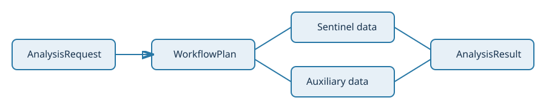

# Architecture



The editable source is available as [`architecture.drawio`](assets/architecture.drawio).

```text
AnalysisRequest
      |
      v
WorkflowPlan -> discovery -> cache/download -> sensor readers
      |                                  |
      +------------ harmonize/fuse <-----+
                         |
                         v
             cube / thermal_cube / predictors[sensor] / auxiliary
```

## Names

`citycube` is the current and only package name (import it as
`import citycube as cc`; the command line is `citycube`). It was called
`sentinel_analysis` until 2026-10-10, and `sentinel3_lst` and `urban_heat`
before that; none of the old names has an active source module. The new
name reflects what the package does: analysis-ready cubes over a city or
any polygon, from Sentinel and non-Sentinel sources alike.

`Sentinel3LST` is not an old project name. It is the local facade for
Sentinel-3 LST products. `Sentinel3LSTClient` builds openEO graphs and remains
separate because it is a different remote backend.

## Data Separation

- `thermal_cube`: Sentinel-3 thermal analysis grid.
- `cube`: the fused analysis cube on the thermal grid, every sensor
  aggregated to it with `<sensor>_matched_time` per variable group.
- `predictors[sensor]`: one fine-resolution cube per non-thermal sensor
  (Sentinel-1/2/5P, Landsat, ECOSTRESS), each on its own acquisition times.
  A single merged cube outer-joined every sensor's times and was mostly NaN
  fill; per-sensor cubes keep memory proportional to real acquisitions.
- `auxiliary['openaq']`: stations, never an invented raster surface.

Gridded auxiliary variables are renamed to
`auxiliary_<provider>_<variable>` when merged to avoid collisions with
satellite variables.
