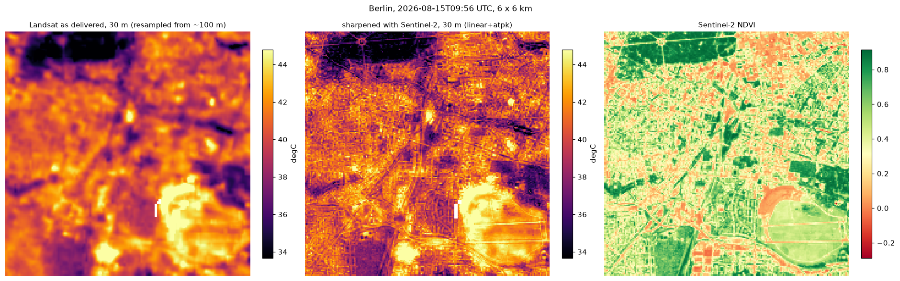

# Downscaling

Sentinel-3 measures land surface temperature every day, but in 1 km cells: a
whole neighbourhood in one number. citycube sharpens it to 100 m using what
Sentinel-2 sees at that resolution (vegetation, built-up surfaces, water) and
the terrain.


## How it works

For each Sentinel-3 pass, on its own:

1. The Sentinel-2 indices (NDVI, NDBI, EVI, NDMI) and the terrain (elevation,
   slope, solar illumination at that hour) are averaged to the 1 km grid.
2. A model learns how temperature relates to them from the clear 1 km cells
   of that pass.
3. The model predicts temperature from the same indices at 100 m.
4. What the model could not explain at 1 km (the residual) is spread onto
   the 100 m cells by area-to-point kriging, so the 100 m map averages back
   exactly to what Sentinel-3 observed and has no 1 km steps.

Cells that were cloudy at 1 km stay empty at 100 m. A pass with no
Sentinel-2 image within the temporal tolerance, or too few clear cells, is
skipped and listed in the result.

## Using it

```python
request = dataclasses.replace(
    request,
    sensors=("sentinel3", "sentinel2"),
    thermal_overpass="day",
    downscale=cc.DownscaleSpec(),           # model="local_trees" by default
)
result = cc.AnalysisWorkflow(request).execute("output/city")
result.downscaled["lst_downscaled"]          # 100 m maps, one per pass
```

Options of `DownscaleSpec`:

| Option | Default | Meaning |
|---|---|---|
| `model` | `"local_trees"` | also `"linear"`, `"random_forest"`, `"xgboost"` |
| `correction` | `"atpk"` | area-to-point kriging; `"smooth"` (iterative bilinear) and `"block"` (uniform per 1 km cell, with visible steps) are the alternatives |
| `mask_unobserved` | `True` | leave cloudy cells empty |
| `model_options` | `{}` | e.g. `{"window": 10}` for `local_trees`, in 1 km cells |

`local_trees` combines one model for the whole city with local models in
moving 10 km windows, because the relation between vegetation and
temperature is not the same in the centre as on the outskirts. It follows
the Data Mining Sharpener (Gao et al. 2012) used by ESA's Sen-ET.

## How good it is

Two checks on Berlin, August 2026.

**Hidden cells.** Part of the city (5 km blocks) is hidden from training and
the model's error is measured there, at 1 km (notebook 04, 15 passes):

| Model | RMSE (K) |
|---|---|
| `local_trees` | 2.05 |
| linear | 2.16 |
| Random Forest | 2.23 |
| XGBoost | 2.23 |
| TsHARP (NDVI only) | 2.46 |
| no skill (each pass's mean) | 2.86 |

The residual correction matters much less than the model. In the run
below (`scripts/validate_downscaling_landsat.py`, 17 passes kept by the
cloud probe) area-to-point kriging was best by a small margin; in notebook
04 (15 passes) switching from `smooth` to `atpk` moved each model by at most
0.03 K, in either direction. Its advantage is exact conservation without
1 km steps rather than accuracy:

| Model + correction | Hidden cells RMSE (K) | Landsat B RMSE (K) |
|---|---|---|
| `local_trees` + atpk | 2.13 | 2.06 |
| `local_trees` + smooth | 2.15 | 2.07 |
| `local_trees` + block | 2.21 | 2.06 |
| linear + atpk | 2.28 | 2.13 |
| linear + smooth | 2.33 | 2.14 |


**Landsat.** Landsat measures temperature at 100 m from its own instrument,
and is never used for training. On the two mornings with both satellites:

| Landsat pass | Downscaled RMSE / correlation | 1 km repeated at 100 m |
|---|---|---|
| A | 3.00 K / 0.46 | 2.97 K / 0.45 |
| B | 2.07 K / 0.66 | 2.28 K / 0.51 |

On B the 100 m map is clearly closer to Landsat than the 1 km observation;
on A neither is, because the two sensors disagree in level that day by more
than the detail adds. Two passes over one city are a small sample.


## Landsat at 30 m

Landsat 8/9 measure temperature at about 100 m; the product is delivered at
30 m only after resampling, so the 30 m cells carry no 30 m detail.
`cc.sharpen_landsat` recovers it from Sentinel-2 with the same per-scene
method: Landsat averaged to 90 m is the coarse target, the Sentinel-2
indices at 30 m the predictors.

```python
request = cc.AnalysisRequest.for_city(city, "2026-08-01", "2026-09-20",
                                      sensors=("landsat", "sentinel2"), resolution_m=30)
request = dataclasses.replace(request, sentinel2_source="stac_cog", target_sensor="landsat")
result = cc.AnalysisWorkflow(request).execute("output/city-30m")
sharpened = cc.sharpen_landsat(result.predictors["landsat"], result.predictors["sentinel2"])
sharpened["lst_downscaled"]                  # 30 m, one map per Landsat pass
```



There is no independent 30 m thermal measurement to check against, so the
test degrades Landsat 3 times and sharpens it back
(`scripts/validate_landsat_sharpening.py`, Berlin, two passes with a
Sentinel-2 image within 5 days):

| Test | Sharpened (linear + atpk) | Bilinear | Repeated |
|---|---|---|---|
| 810 m to 270 m | **1.03 K** | 1.29 K | 1.32 K |
| 540 m to 180 m | **1.00 K** | 1.15 K | 1.21 K |
| 270 m to 90 m | 0.99 K | **0.84 K** | 0.93 K |

Where the reference is genuinely resolved (180 and 270 m), sharpening beats
interpolation by 13 to 20 %. At 90 m the reference itself is blurred by the
sensor, so smooth interpolation scores best there: that test cannot judge
detail finer than the sensor's own. The linear model is the default here;
`local_trees` is within 1 to 3 % and Random Forest is clearly worse, as
tree models transfer poorly from the coarse scale they are fitted at to
the fine one.

## Other tools

- **STARFM and ESTARFM** fill the days between Landsat passes by adding the
  change Sentinel-3 saw to the last Landsat map (`cc.fuse_starfm`,
  `cc.fuse_estarfm`). Against a real Landsat scene a month later STARFM's
  error was 2.7 K.
- **Prediction intervals** (`cc.fit_conformal_downscaler`) work on synthetic
  data but are not yet calibrated on real data: 90 % intervals covered
  between 42 % and 93 % of real cells.


Notebook [04](guides.md) runs all of this on real data. The literature
behind these choices is reviewed in
[`dev/downscaling-review-2026.md`](https://github.com/JSempereH/citycube/blob/main/dev/downscaling-review-2026.md),
and every benchmark run is in
[`dev/downscaling-research.md`](https://github.com/JSempereH/citycube/blob/main/dev/downscaling-research.md).
