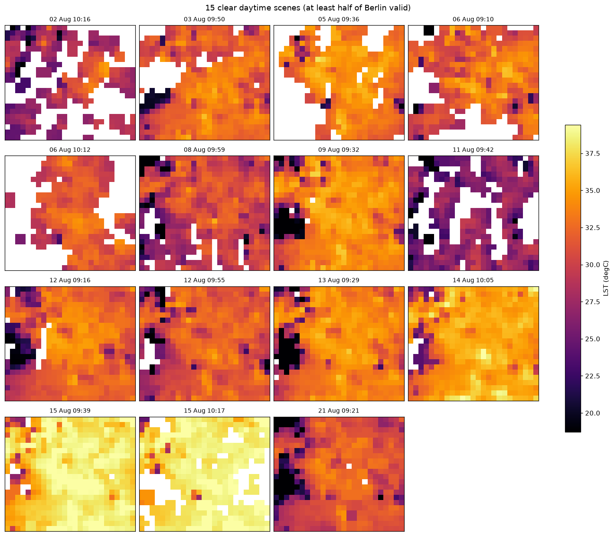
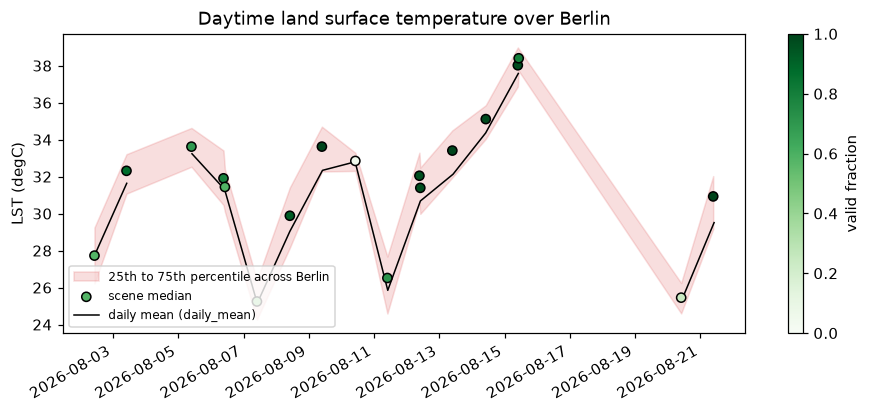
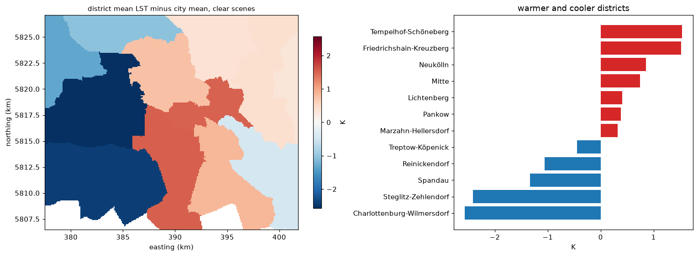

# Getting started

This page takes you from nothing to a land surface temperature map of a city
in about ten minutes. Each later step adds one thing.

## 1. Install

```bash
pip install "citycube[cloud] @ git+https://github.com/JSempereH/citycube.git"
pip install matplotlib   # only for the plots below
```

`cloud` adds Zarr, the format results are saved in. Other extras add more
sensors and models; you only need them for the later steps:

| Extra | For |
|---|---|
| `optical` | Sentinel-2, terrain, GeoTIFF export |
| `landsat` | reading from Planetary Computer: Landsat, and Sentinel-2 with `sentinel2_source="stac_cog"` |
| `ml` | the downscaling models |
| `ecostress` | ECOSTRESS thermal data |
| `auxiliary` | ERA5 and CAMS |

## 2. Credentials

Sentinel data comes from the Copernicus Data Space Ecosystem (CDSE), which is
free. Create an account at [dataspace.copernicus.eu](https://dataspace.copernicus.eu),
then an OAuth client in its dashboard ([setup.md](setup.md) has the details),
and put both in a `.env` file in the directory you run from:

```bash
CDSE_USERNAME=you@example.com
CDSE_PASSWORD=...
CDSE_CLIENT_ID=...
CDSE_CLIENT_SECRET=...
```

Check them:

```bash
citycube check-credentials
```

It tests every provider the library can use; for this page only CDSE has to pass.

## 3. Your first map

Two weeks of daytime Sentinel-3 temperature over Berlin:

```python
import dataclasses
import matplotlib.pyplot as plt
import citycube as cc

request = cc.AnalysisRequest.for_city(
    cc.get_city("berlin"), "2026-08-01", "2026-08-14", sensors=("sentinel3",),
)
request = dataclasses.replace(request, thermal_overpass="day")

result = cc.AnalysisWorkflow(request).execute("output/berlin")
lst = result.thermal_cube["lst"]          # degrees Celsius, 1 km grid, one map per pass

clearest = lst.isel(time=int(lst.notnull().mean(["y", "x"]).argmax()))
clearest.plot(cmap="inferno")
plt.show()
```

`execute` searches the catalogue, downloads only the files it needs (about
17 MB per pass instead of 70 MB), crops them to the city, screens clouds and
bad pixels, and puts every pass on the same grid. A second run reuses what is
already in `output/berlin` and downloads nothing.



Cells hidden by clouds stay empty: nothing is filled in.

## 4. How it changes over time

Every map has a time stamp, so a time series is one line:

```python
lst.median(["y", "x"]).plot(marker="o")
plt.ylabel("median LST over the city (degC)")
plt.show()
```



For a summary of the whole period (mean, 95th percentile, number of passes
above 35 degC per cell):

```python
heat = cc.heat_hazard_metrics(result.thermal_cube, threshold_celsius=35)
heat["hot_observation_count"].plot()
```

## 5. Save the results

```python
result.save("output/berlin/result")   # Zarr cubes + request.json + provenance.json
cc.write_cog(clearest, "clearest_lst.tif")  # a GeoTIFF for QGIS (needs the optical extra)
```

`request.json` reruns the same analysis later:
`cc.AnalysisRequest.from_json("output/berlin/result/request.json")`.

## 6. Going further

**Another city.** Five cities are built in (`cc.list_cities()`). For any other
area, pass a bounding box or the city boundary:

```python
aoi = cc.AOI.from_geojson("my_city.geojson")   # or cc.AOI(west, south, east, north)
request = dataclasses.replace(request, aoi=aoi)
```

**100 m instead of 1 km.** Add Sentinel-2 and turn on downscaling (extras
`optical`, `landsat` and `ml`):

```python
request = cc.AnalysisRequest.for_city(
    cc.get_city("berlin"), "2026-08-01", "2026-08-21",
    sensors=("sentinel3", "sentinel2"), resolution_m=100,
)
request = dataclasses.replace(
    request, thermal_overpass="day", sentinel2_source="stac_cog",
    min_clear_fraction=0.5, downscale=cc.DownscaleSpec(),
)
result = cc.AnalysisWorkflow(request).execute("output/berlin-100m")
result.downscaled["lst_downscaled"]   # 100 m, one map per clear pass
```


**Statistics per district.** With a GeoJSON of districts or neighbourhoods:

```python
zones = cc.ZoneSet.from_geojson("districts.geojson", id_field="name")
table = cc.zonal_statistics(result.downscaled["lst_downscaled"], zones, statistics=("count", "mean", "p90"))
table.to_csv("districts.csv", index=False)
```



**Without writing code.** The worker is a small web service with a map to
draw the area, a form for the dates and sensors, and a download button
([platform.md](platform.md)). From a clone of the repository:

```bash
cp worker/.env.example worker/.env   # set WORKER_API_TOKEN and the CDSE credentials
docker compose up -d                 # then open http://localhost:8100
```

## Where next

- [Guides](guides.md): eight notebooks that do all of the above and more on
  real data, with every output shown.
- [Workflows](workflows.md): every request option.
- [Downscaling](downscaling.md): how the 100 m maps are made and how well
  they match Landsat.
- [Limitations](limitations.md): what to know before relying on a result.
