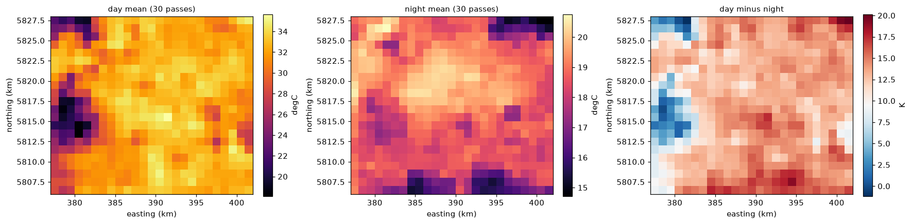
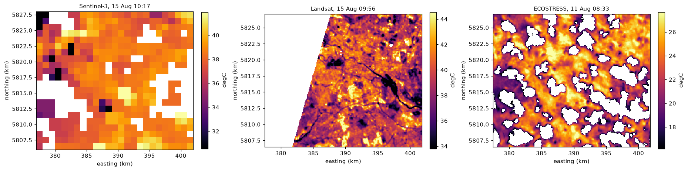
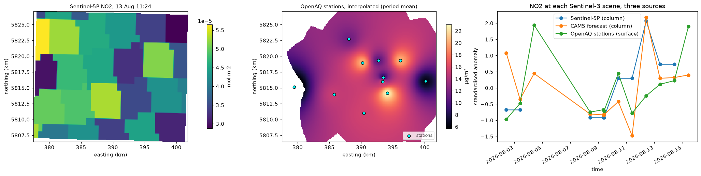
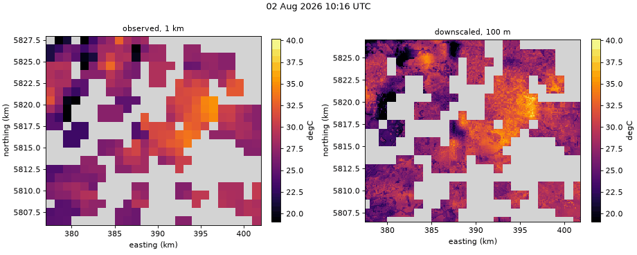
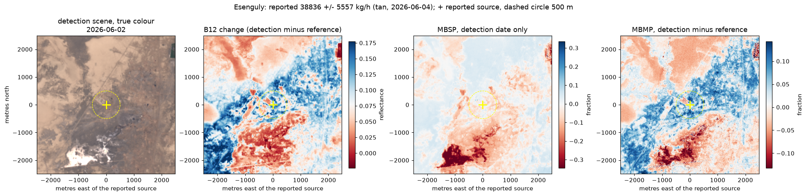

# Guides

A series of notebooks that use the library on real data, end to end, with every step explained before the code that does it. They are committed with their outputs, so they can be read without running anything; running them again reproduces the analysis with whatever data the providers serve today.

All of them use the same place and period (Berlin, August 2026), so downloads made by one are cached and reused by the next. Run them in order the first time.

| Notebook | What it shows |
|---|---|
| [`01_getting_started`](https://github.com/JSempereH/citycube/blob/main/notebooks/01_getting_started.ipynb) | credential checks, cities and areas of interest, grids and chips, declarative requests saved as JSON, plans and size estimates, product discovery for every sensor, day and night passes, the command line |
| [`02_land_surface_temperature`](https://github.com/JSempereH/citycube/blob/main/notebooks/02_land_surface_temperature.ipynb) | Sentinel-3 LST end to end: scene quality, choosing clear scenes with a cloud probe before downloading them, maps, a gallery of clear scenes, time series, statistics, heat-hazard indicators, day versus night, writing Zarr, NetCDF, GeoTIFF, CSV and PNG, the SAFE reader and gridding by hand, server-side processing with openEO |
| [`03_multisensor_fusion`](https://github.com/JSempereH/citycube/blob/main/notebooks/03_multisensor_fusion.ipynb) | Sentinel-1/2/3/5P, Landsat, ECOSTRESS, ERA5, CAMS, OpenAQ and terrain fused in one request: matching in time, each source mapped, thermal sensors compared, NO2 from three sources and a column-to-surface estimate, air against surface temperature, how each source relates to LST |
| [`04_downscaling`](https://github.com/JSempereH/citycube/blob/main/notebooks/04_downscaling.ipynb) | per-scene sharpening to 100 m from one request, conservation of the observation, independent validation against Landsat, a blocked-holdout comparison of linear, Random Forest, XGBoost, local-window trees and TsHARP models, conformal prediction intervals, STARFM and ESTARFM |
| [`05_animations`](https://github.com/JSempereH/citycube/blob/main/notebooks/05_animations.ipynb) | animated GIFs and MP4s: three weeks of LST, observed against downscaled, a Sentinel-2 time-lapse, a map moving with its time series, Sentinel-5P NO2 |
| [`06_worker_api`](https://github.com/JSempereH/citycube/blob/main/notebooks/06_worker_api.ipynb) | the worker's HTTP API from Python: readiness, submitting a job, progress, logs, downloading and plotting the result, listing, cancelling and deleting jobs, rejected requests, the same with `curl` |
| [`07_methane_plumes`](https://github.com/JSempereH/citycube/blob/main/notebooks/07_methane_plumes.ipynb) | a confirmed leak from Carbon Mapper's live catalogue, a Sentinel-2 L1C detection and reference pair on the same tile, 2.5 km chips, the MBSP and MBMP methane retrievals, and how to tell a plume from surface change |
| [`08_districts_and_zones`](https://github.com/JSempereH/citycube/blob/main/notebooks/08_districts_and_zones.ipynb) | official Berlin district boundaries as a polygon AOI, simplifying a detailed outline, clipping results to the city, per-district and per-scene statistics of the 100 m temperature, warmer and cooler districts, CSV and GeoJSON outputs |

## Results

A selection of the figures the notebooks produce, all from real data over
Berlin in August 2026 unless noted.

### 02 Land surface temperature


Each clear daytime pass on the same scale. The Grunewald forest and the
Havel lakes in the west stay cool on every pass, while the level of the whole
city moves by more than 10 K from one day to the next with the weather.



Day against night. By day the contrast follows vegetation and water; at
night the dense centre stays warmest, which is the urban heat island in its
usual sense.

### 03 Multisensor fusion



Three thermal sensors over the same city: Sentinel-3 at 1 km, Landsat at
100 m (the white wedge is outside its swath) and ECOSTRESS at 70 m on a
different day and hour. Blank cells are clouds.



Nitrogen dioxide from space (Sentinel-5P column), from the ground (OpenAQ
stations, interpolated only near stations) and from a model (CAMS), as
standardised anomalies at each Sentinel-3 pass.

### 04 Downscaling


One pass at 1 km and at 100 m, the Sentinel-2 NDVI the model used and the
correction that keeps the 100 m map consistent with the 1 km observation.


The independent check: a Landsat pass on the same morning against the
downscaled map, pixel by pixel. Rivers, parks and industrial areas fall in
the same places; Landsat, at a finer native resolution, shows hotter
extremes than the downscaled map.


Every model on cells hidden from training. The local-window model
(`local_trees`, the default) has the lowest error.



### 07 Methane plumes



A leak of about 39 t/h reported by Carbon Mapper (Tanager satellite, 4 June
2026), seen by Sentinel-2 two days earlier. Surface changes between the two dates (dark bands in the
south-west) are stronger than any plume signal near the source: the notebook
explains why one Sentinel-2 pair is often not enough.

### 08 Districts


Each district against the city mean over the clear passes: the dense centre
(Tempelhof-Schoeneberg, Friedrichshain-Kreuzberg) about 1.5 K warmer, the
forested south-west about 2.5 K cooler.

## Running them

```bash
uv run --extra notebook --extra cdse --extra optical --extra cloud --extra landsat \
  --extra ecostress --extra auxiliary --extra ml jupyter lab notebooks/
```

Credentials for each provider are described in [`setup.md`](setup.md); notebook 01 checks them all. Notebooks 05 and 08 read the results saved by earlier notebooks (02, 03 and 04), and notebook 06 needs a running worker (`make worker` or `docker compose up -d`).

Outputs go to `output/notebooks/`, which Git ignores: `work/` holds the shared download and AOI-subset cache, `figures/` the PNG figures, `animations/` the GIFs and MP4s, and `0N_export/` what each notebook writes.

The first run of the whole series downloads several gigabytes (mostly whole-orbit Sentinel-5P products of about 600 MB each, and the Sentinel-2 L1C scenes of about 800 MB) and keeps only AOI subsets of most of it. Most notebooks peak under 0.6 GB of memory and 04 (which fits many models) at about 1.7 GB; run one at a time.

## What the outputs show, and do not

The notebooks report what the data says, including when a method does not win: notebook 04 compares the sharpened map with an independent Landsat scene and prints whether it beats simply repeating the 1 km value, and notebook 07 explains why a single Sentinel-2 pair often shows no clear plume even for a confirmed leak. Results depend on clouds and on what the providers serve on the day they are run.
