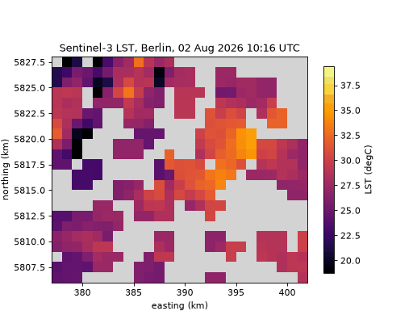

# citycube

citycube builds analysis-ready data cubes over a city, or any polygon, from
satellite and weather data, and sharpens Sentinel-3 land surface temperature
from 1 km to 100 m.

You give it an area and a date range. It finds the products, downloads only
what it needs, cuts them to the area, screens clouds and bad pixels, and puts
every source on one grid and one time axis, with the units, quality masks and
origin of every value kept.

## What it reads

- **Sentinel-3**: land surface temperature, 1 km, several passes a day.
- **Sentinel-2**: reflectance and vegetation, built-up and water indices, 10 to 100 m.
- **Sentinel-1**: radar backscatter, through clouds.
- **Sentinel-5P**: nitrogen dioxide and other gases.
- **Landsat 8/9 and ECOSTRESS**: land surface temperature at about 100 m, less often.
- **ERA5, CAMS and OpenAQ**: air temperature, modelled air quality and ground stations.
- **Copernicus DEM**: elevation, slope and solar illumination.

## What it does with them

- Daytime or night-time thermal passes, and only the scenes clear over the area.
- Per-scene downscaling of land surface temperature to 100 m, checked against Landsat.
- Clipping to the exact city boundary and statistics per district or any other zone.
- Zarr, NetCDF, GeoTIFF, CSV and GeoJSON outputs, plots and animations.
- A small web service with a map and a job queue, for use without code.

## Start here

- [Getting started](getting-started.md): install, credentials and a first map in ten minutes.
- [Guides](guides.md): eight notebooks on real data, from a single map to districts and methane plumes.
- [Limitations](limitations.md): what to know before relying on a result.

A Sentinel-5P or CAMS column is not a surface concentration. citycube keeps
them apart, and any conversion to a surface estimate is explicit and marked
as modelled.
